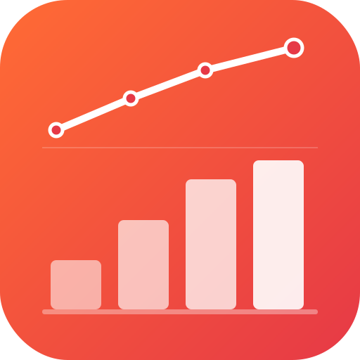
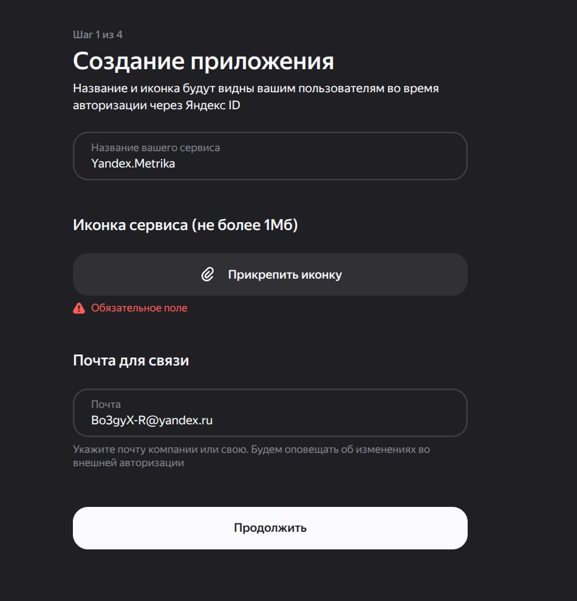
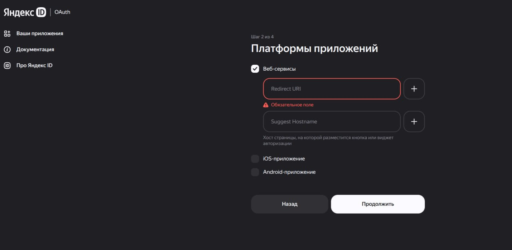
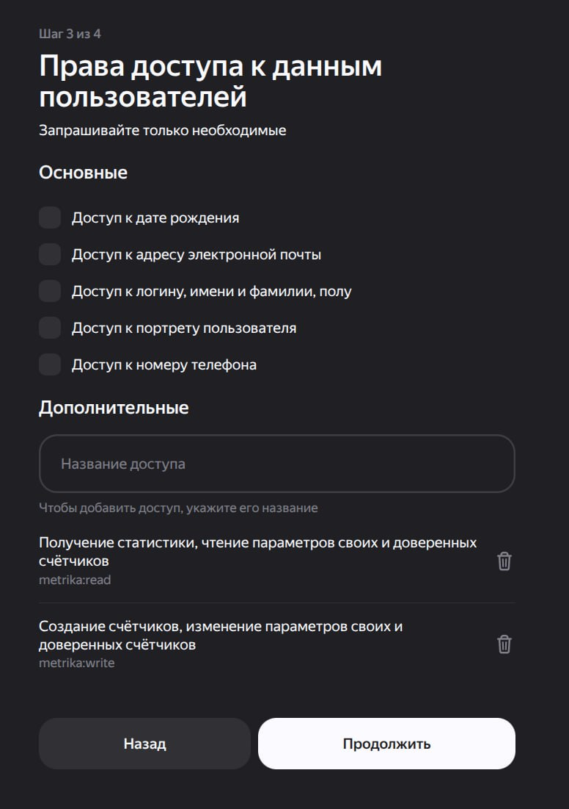

# moonshine-yandex-metrika

[](https://packagist.org/packages/tikhomirov/moonshine-yandex-metrika)
[](https://packagist.org/packages/tikhomirov/moonshine-yandex-metrika)
[](LICENSE)

Пакет добавляет в [MoonShine 4.x](https://moonshine-laravel.com) отдельную страницу дашборда с ключевой статистикой из **Яндекс.Метрики**: визиты, просмотры, уник посетители, отказы, топ страниц, источники трафика, поисковые фразы, страны, браузеры.



---

## Требования

- PHP 8.2+
- Laravel 11 или 12
- MoonShine 4.x

---

## Установка пакета

```bash
composer require tikhomirov/moonshine-yandex-metrika
```

Публикуем конфиг:

```bash
php artisan vendor:publish --tag=moonshine-yandex-metrika-config
```

Добавляем в `.env`:

```env
YANDEX_METRIKA_TOKEN=ваш_токен
YANDEX_METRIKA_COUNTER_ID=ваш_номер_счётчика
```

Регистрируем страницу в MoonShine провайдере:

```php
// app/Providers/MoonShineServiceProvider.php
use Tikhomirov\MoonshineYandexMetrika\Pages\MetrikaDashboardPage;

public function menu(): array
{
    return [
        MenuItem::make('Яндекс.Метрика', MetrikaDashboardPage::class)
            ->icon('presentation-chart-bar'),
    ];
}
```

---

## Получение OAuth-токена

Это самый трудоёмкий шаг — нужно зарегистрировать OAuth-приложение в Яндексе. Ниже подробная инструкция по каждому шагу.

### Шаг 1 — Создать приложение

1. Перейти на [oauth.yandex.ru](https://oauth.yandex.ru/) и нажать **«Зарегистрировать новое приложение»**
2. Заполнить форму:
   - **Название сервиса** — любое, например `Yandex.Metrika`
   - **Иконка** — обязательное поле, загрузить PNG/JPG до 1 МБ (можно использовать [`docs/icon.png`](docs/icon.png) из этого репозитория)
   - **Почта для связи** — ваша рабочая почта



---

### Шаг 2 — Платформы приложений

1. Отметить чекбокс **«Веб-сервисы»**
2. В поле **Redirect URI** ввести:
   ```
   https://oauth.yandex.ru/verification_code
   ```
   Это официальный адрес Яндекса для ручного получения токена — после авторизации он покажет токен прямо на странице.
3. Поле **Suggest Hostname** — оставить пустым
4. Чекбоксы **iOS** и **Android** — не трогать



---

### Шаг 3 — Права доступа

1. Раздел **«Основные»** — ничего не отмечать (это права на данные пользователей, нам не нужны)
2. Раздел **«Дополнительные»** — в поле «Название доступа» по очереди добавить:
   - `metrika:read` — чтение статистики и параметров счётчиков *(обязательно)*
   - `metrika:write` — управление счётчиками *(необязательно, если нужен только просмотр)*



---

### Шаг 4 — Завершение

После финального шага Яндекс покажет страницу с **Client ID** приложения. Скопируйте его.

---

### Получение токена

Откройте в браузере (залогинившись под нужным аккаунтом Яндекса):

```
https://oauth.yandex.ru/authorize?response_type=token&client_id=ВАШ_CLIENT_ID
```

Нажмите **«Разрешить»** → вас перенаправит на страницу с токеном в URL:

```
https://oauth.yandex.ru/verification_code#access_token=y0__wg...
```

Скопируйте значение `access_token` и вставьте в `.env`:

```env
YANDEX_METRIKA_TOKEN=y0__wg...
```

---

### Номер счётчика

Номер счётчика виден в URL при открытии Метрики:

```
https://metrika.yandex.ru/stat/visits?id=XXXXXXXX
```

Или в интерфейсе: **Метрика → Настройки счётчика → Номер счётчика**.

```env
YANDEX_METRIKA_COUNTER_ID=XXXXXXXX
```

---

## Конфигурация

Все настройки в `config/moonshine-yandex-metrika.php`:

```php
return [
    'token'      => env('YANDEX_METRIKA_TOKEN'),
    'counter_id' => env('YANDEX_METRIKA_COUNTER_ID'),

    // Период по умолчанию (дней)
    'days' => 30,

    // Кэш в секундах (0 = отключить)
    'cache_ttl' => 3600,

    // Отдельное хранилище кэша (null = дефолтное)
    'cache_store' => null,

    // Какие виджеты показывать
    'widgets' => [
        'visits'          => true,   // Визиты
        'pageviews'       => true,   // Просмотры
        'unique_visitors' => true,   // Уникальные посетители
        'bounce_rate'     => true,   // Отказы
        'top_pages'       => true,   // Топ страниц
        'traffic_sources' => true,   // Источники трафика
        'search_phrases'  => true,   // Поисковые фразы
        'geo'             => true,   // Страны
        'browsers'        => true,   // Браузеры
    ],

    // Макс. строк в таблицах
    'max_results' => 10,

    // Заголовок и иконка пункта меню
    'page_title' => 'Яндекс.Метрика',
    'page_icon'  => 'presentation-chart-bar',
];
```

---

## Использование сервиса напрямую

`MetrikaService` можно инжектировать куда угодно:

```php
use Tikhomirov\MoonshineYandexMetrika\Services\MetrikaService;

class MyController extends Controller
{
    public function index(MetrikaService $metrika)
    {
        $visits  = $metrika->totalVisits(days: 7);
        $pages   = $metrika->topPages(days: 7, maxResults: 5);
        $sources = $metrika->trafficSources();
    }
}
```

### Доступные методы

| Метод | Описание |
|---|---|
| `totalVisits(?int $days)` | Всего визитов |
| `totalPageViews(?int $days)` | Всего просмотров |
| `uniqueVisitors(?int $days)` | Уникальных посетителей |
| `bounceRate(?int $days)` | Процент отказов |
| `topPages(?int $days, int $maxResults)` | Топ страниц по просмотрам |
| `trafficSources(?int $days, int $maxResults)` | Источники трафика |
| `searchPhrases(?int $days, int $maxResults)` | Поисковые фразы |
| `geoCountries(?int $days, int $maxResults)` | Визиты по странам |
| `browsers(?int $days, int $maxResults)` | Визиты по браузерам |
| `visitsByDay(?int $days)` | Визиты по дням (для графиков) |
| `request(array $params)` | Произвольный запрос к API |

---

## Расширение

### Своя страница дашборда

```php
use Tikhomirov\MoonshineYandexMetrika\Pages\MetrikaDashboardPage;

class MyMetrikaPage extends MetrikaDashboardPage
{
    protected function components(): iterable
    {
        $base = iterator_to_array(parent::components());

        $base[] = Box::make('Мой виджет', [...]);

        return $base;
    }
}
```

### Публикация шаблонов

```bash
php artisan vendor:publish --tag=moonshine-yandex-metrika-views
```

Затем редактируй файлы в `resources/views/vendor/moonshine-yandex-metrika/`.

---

## Локализация

Поставляется с переводами на **русский** и **английский**. Для публикации:

```bash
php artisan vendor:publish --tag=moonshine-yandex-metrika-lang
```

---

## Кэширование

```env
YANDEX_METRIKA_CACHE_TTL=3600      # секунд, 0 = без кэша
YANDEX_METRIKA_CACHE_STORE=redis   # опционально: конкретный драйвер
```

---

## Лицензия

MIT — см. [LICENSE](LICENSE).
