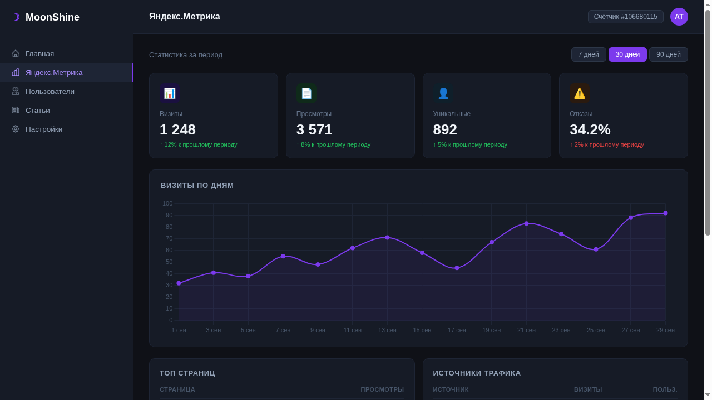

# moonshine-yandex-metrika

[](https://packagist.org/packages/tikhomirov/moonshine-yandex-metrika)
[](https://packagist.org/packages/tikhomirov/moonshine-yandex-metrika)
[](LICENSE)

**Яндекс.Метрика** dashboard page for [MoonShine 4.x](https://moonshine-laravel.com) admin panel.

Displays key site analytics — visits, page views, unique visitors, bounce rate, top pages, traffic sources, search phrases, countries and browsers — all on a single configurable page inside your MoonShine admin.



---

## Requirements

- PHP 8.2+
- Laravel 11 or 12
- MoonShine 4.x

---

## Installation

```bash
composer require tikhomirov/moonshine-yandex-metrika
```

Publish the config:

```bash
php artisan vendor:publish --tag=moonshine-yandex-metrika-config
```

Add to your `.env`:

```env
YANDEX_METRIKA_TOKEN=your_oauth_token
YANDEX_METRIKA_COUNTER_ID=12345678
```

Register the dashboard page in your MoonShine provider:

```php
// app/Providers/MoonShineServiceProvider.php
use YourVendor\MoonshineYandexMetrika\Pages\MetrikaDashboardPage;

public function menu(): array
{
    return [
        MenuItem::make('Яндекс.Метрика', MetrikaDashboardPage::class)
            ->icon('presentation-chart-bar'),
    ];
}
```

---

## Getting the OAuth Token

1. Go to [oauth.yandex.ru](https://oauth.yandex.ru/) → **Register new application**
2. Enter a name, select **Yandex.Metrika** → **Read statistics (own and trusted counters)**
3. Select **Development URL** as Callback
4. Copy the **Application ID**
5. Open in browser:
   ```
   https://oauth.yandex.ru/authorize?response_type=token&client_id=YOUR_APP_ID
   ```
6. Allow access → copy the token from the URL → paste into `.env`

---

## Configuration

All options are in `config/moonshine-yandex-metrika.php`:

```php
return [
    'token'      => env('YANDEX_METRIKA_TOKEN'),
    'counter_id' => env('YANDEX_METRIKA_COUNTER_ID'),

    // Default period in days
    'days' => 30,

    // Cache TTL in seconds (0 = disabled)
    'cache_ttl' => 3600,

    // Which widgets to show
    'widgets' => [
        'visits'          => true,
        'pageviews'       => true,
        'unique_visitors' => true,
        'bounce_rate'     => true,
        'top_pages'       => true,
        'traffic_sources' => true,
        'search_phrases'  => true,
        'geo'             => true,
        'browsers'        => true,
    ],

    'max_results' => 10,
    'page_title'  => 'Яндекс.Метрика',
    'page_icon'   => 'presentation-chart-bar',
];
```

---

## Using the Service Directly

You can inject `MetrikaService` anywhere in your application:

```php
use YourVendor\MoonshineYandexMetrika\Services\MetrikaService;

class MyController extends Controller
{
    public function index(MetrikaService $metrika)
    {
        $visits  = $metrika->totalVisits(days: 7);
        $pages   = $metrika->topPages(days: 7, maxResults: 5);
        $sources = $metrika->trafficSources();
    }
}
```

### Available methods

| Method | Description |
|---|---|
| `totalVisits(?int $days)` | Total visits |
| `totalPageViews(?int $days)` | Total page views |
| `uniqueVisitors(?int $days)` | Unique visitors |
| `bounceRate(?int $days)` | Bounce rate (%) |
| `topPages(?int $days, int $maxResults)` | Most viewed pages |
| `trafficSources(?int $days, int $maxResults)` | Traffic sources |
| `searchPhrases(?int $days, int $maxResults)` | Search phrases |
| `geoCountries(?int $days, int $maxResults)` | Visits by country |
| `browsers(?int $days, int $maxResults)` | Visits by browser |
| `visitsByDay(?int $days)` | Visits per day (for charts) |
| `request(array $params)` | Raw API request |

---

## Extending

### Custom dashboard page

```php
use YourVendor\MoonshineYandexMetrika\Pages\MetrikaDashboardPage;
use YourVendor\MoonshineYandexMetrika\Services\MetrikaService;

class MyMetrikaPage extends MetrikaDashboardPage
{
    protected function components(): iterable
    {
        $base = iterator_to_array(parent::components());

        // Add your own components...
        $base[] = Box::make('My Widget', [...]);

        return $base;
    }
}
```

### Custom views

```bash
php artisan vendor:publish --tag=moonshine-yandex-metrika-views
```

Then edit files in `resources/views/vendor/moonshine-yandex-metrika/`.

---

## Localization

English and Russian are included. To publish translations:

```bash
php artisan vendor:publish --tag=moonshine-yandex-metrika-lang
```

Then edit `lang/vendor/moonshine-yandex-metrika/`.

---

## Caching

Responses are cached using your default Laravel cache driver. Tune with:

```env
YANDEX_METRIKA_CACHE_TTL=3600       # seconds, 0 = no cache
YANDEX_METRIKA_CACHE_STORE=redis    # optional: specific cache store
```

---

## License

MIT — see [LICENSE](LICENSE).
